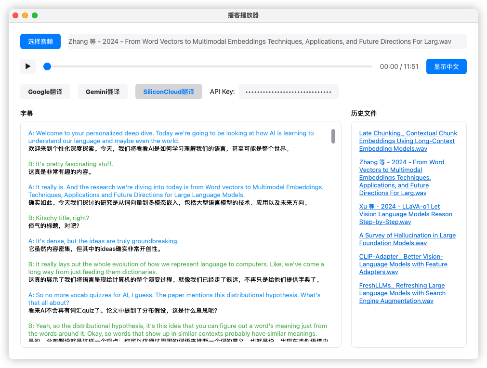

# Podcast Player with Translation

一个支持多语言翻译的播客播放器，具有音频播放、字幕显示和实时翻译功能。

## 功能特点

- 支持音频文件播放和进度控制
- 实时字幕显示和同步
- 多种翻译引擎支持（Google、Gemini、SiliconCloud）
- 字幕缓存和历史记录功能

## 演示

### 界面预览


### 功能演示视频
<video width="100%" controls>
  <source src="./data/demo-video.mp4" type="video/mp4">
</video>

主要功能展示：
1. 音频文件加载与播放
2. 实时字幕识别
3. 多引擎翻译切换
4. 字幕中英文同步显示

## 环境要求

- Python 3.10
- PyQt5
- AssemblyAI API（注册送额度，用于语音识别）
- Gemini API （使用免费API，限制较多，不推荐）
- SiliconCloud API （注册送额度，推荐）
- Google 翻译（无需 API Key）

## 安装步骤

1. 克隆仓库： 
```bash
bash
git clone https://github.com/reilxlx/podcast-player.git
cd podcast-player
```

2. 安装依赖：
```bash
pip install -r requirements.txt
```


## 配置 API 密钥

1. 在 `podcast_data/config.json` 文件中填写 API 密钥：
```json
{
  "gemini_api_key": "your_gemini_api_key_here",
  "silicon_cloud_api_key": "your_silicon_cloud_api_key_here",
  "asr_api_key": "your_asr_api_key_here"
}
```


2. 获取所需的 API 密钥：
- Gemini API：从 Google AI Studio 获取 （https://aistudio.google.com/）
- SiliconCloud API：从 SiliconFlow 平台获取 （https://cloud.siliconflow.cn/）
- ASR API：从 AssemblyAI 获取 （https://www.assemblyai.com/）

## 使用方法

1. 启动应用：
```bash
python main.py
```


2. 使用界面：
- 点击打开文件按钮选择音频文件
- 选择所需的翻译引擎（Google 翻译无需 API Key）
- 使用播放控制按钮控制音频播放
- 查看实时字幕和翻译结果

## 项目结构

```
podcast_player/
│
├── main.py                    # 主程序入口
├── player.py                  # 播放器核心实现
├── config.py                  # 配置文件处理
├── utils.py                   # 工具函数
├── ui_components.py           # UI组件
├── threads.py                 # 线程处理
│
├── podcast_data/             # 数据存储目录
│   ├── config.json           # api key配置文件
│   ├── audio_index.json      # 音频索引
│   └── subtitles/            # 字幕缓存目录
│
└── translation/              # 翻译模块
    ├── translationGoogle.py
    ├── translationGemini.py
    └── translationSiliconCloud.py
```


## 注意事项

- 翻译服务可能有 API 调用限制，请注意使用频率
- 翻译结果可能存在偏差，请根据实际情况使用
